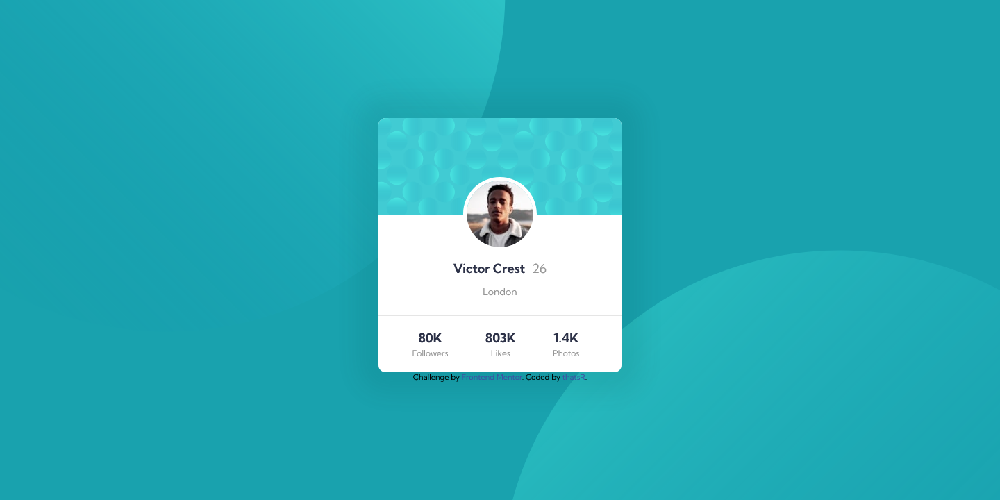
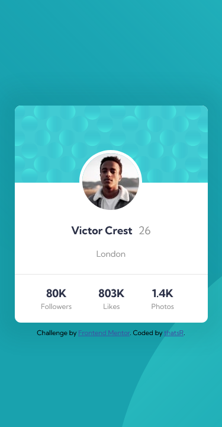

# Frontend Mentor - Profile card component solution

This is a solution to the [Profile card component challenge on Frontend Mentor](https://www.frontendmentor.io/challenges/profile-card-component-cfArpWshJ). Frontend Mentor challenges help you improve your coding skills by building realistic projects. 

## Overview

### The challenge

- Build out the project to the designs provided

### Screenshot

| desktop | mobile |
| --- | --- |
|  |  |

### Links

- Solution URL: https://github.com/thatsR/FM-Profile-card-component.git
- Live Site URL: https://thatsr.github.io/FM-Profile-card-component/

## My process

### Built with

- Semantic HTML5 markup
- CSS custom properties
- Flexbox
- Sass

### Continued development

I would like to figure out how to get the top background circle to line up correctly as the viewport gets bigger or smaller. The bottom one seems to work no problem, but when I try to use negative vw values for the top it doesn't work how I expect.

## Author

- Frontend Mentor - [@thatsR](https://www.frontendmentor.io/profile/thatsR)
